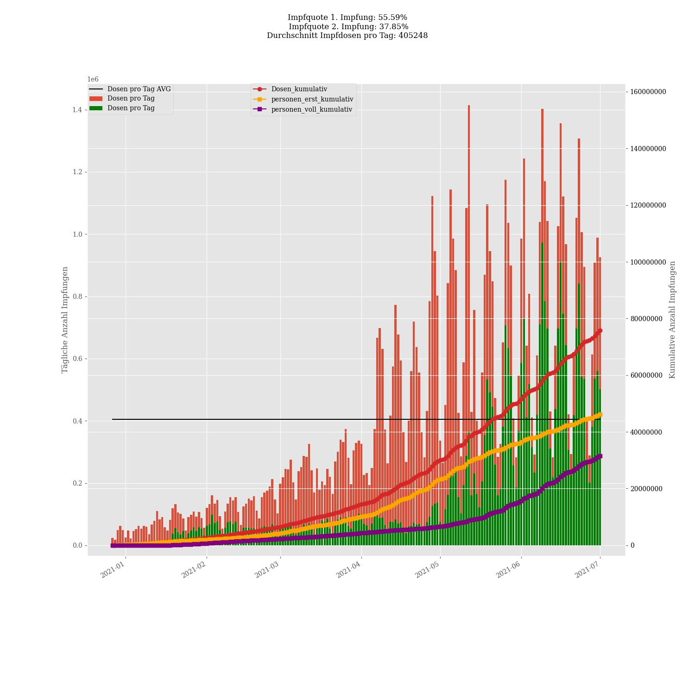
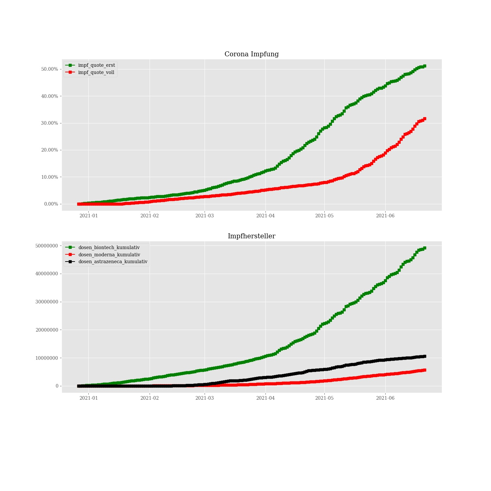
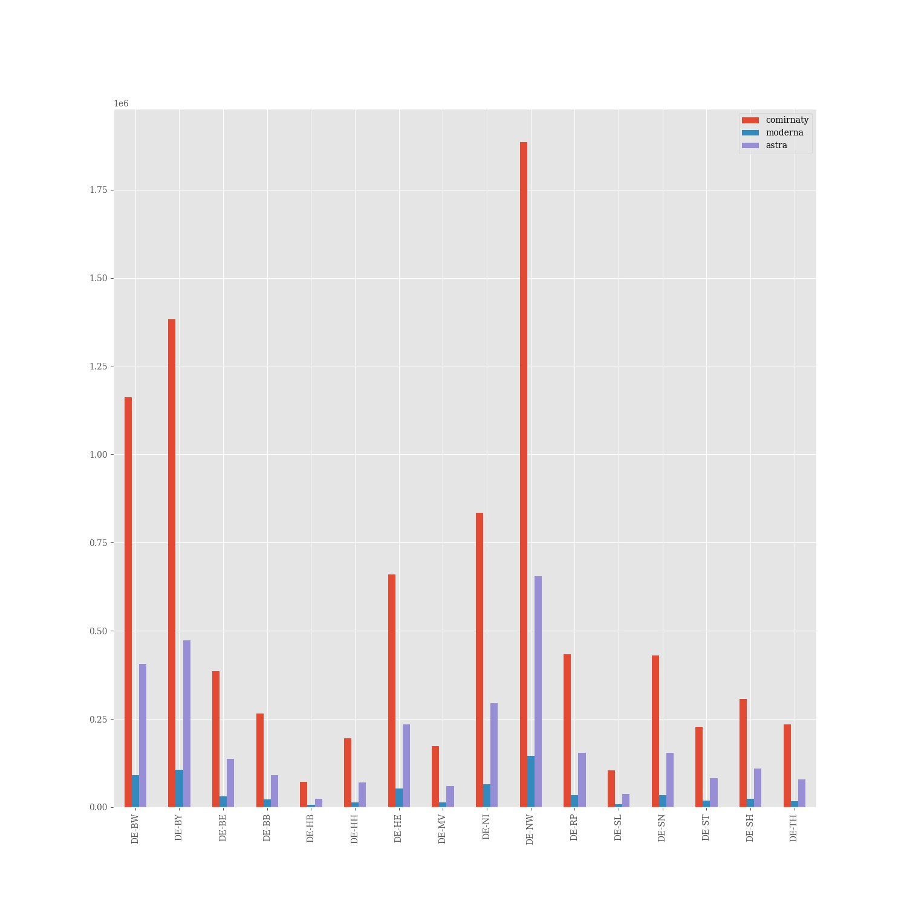

# Corona vaccine Germany - Stand 2021-07-13
## Dashboard by [Simon Hamacher](https://www.shamacher.eu)
## Impfstoffe Übersicht
**Impfstoffhersteller** | **verimpfte Dosen**
-------- | :--------:
Biontech | 61338428
Moderna | 7608142
Astrazeneca | 12120000

## Quoten
**Total Verimpfte Dosen:** | |81066570&nbsp;
-------- | :--------:| :--------:
**Erst-Impfquote** | **58.91** %| **49007589** Personen
**Voll-Impfquote** | **43.70** %| **36350481** Personen
**Imfungen Durchschnitt** | |**418152.36** pro Tag 
## Bundesländer
**Bundesland** | **Prozent von gelieferten Imfdosen verimpft**
-------- | :--------:
DE-BW | 91.37 %
DE-BY | 85.96 %
DE-BE | 88.63 %
DE-BB | 87.25 %
DE-HB | 101.88 %
DE-HH | 89.50 %
DE-HE | 89.22 %
DE-MV | 89.00 %
DE-NI | 89.93 %
DE-NW | 91.80 %
DE-RP | 93.88 %
DE-SL | 93.28 %
DE-SN | 83.17 %
DE-ST | 88.36 %
DE-SH | 94.57 %
DE-TH | 89.23 %
## Graphen

### Lieferungen je Bundesland:

### Impfungen und Lieferung je Bundesland:

