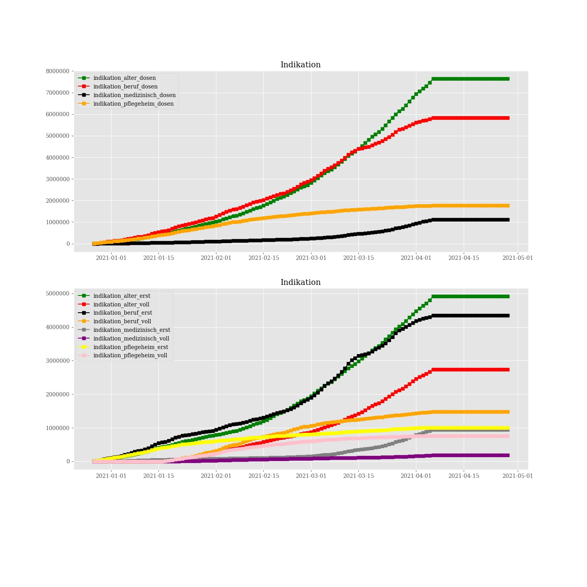

# Corona vaccine Germany - Stand 2021-03-15
## Dashboard by [Simon Hamacher](https://www.shamacher.eu)
## Impfstoffe Übersicht
**Impfstoffhersteller** | **verimpfte Dosen**
-------- | :--------:
Biontech | 7587462
Moderna | 327612
Astrazeneca | 1748813

## Quoten
**Total Verimpfte Dosen:** | 9663887
-------- | :--------:
**Erst-Impfquote** | 8.07 %
**Voll-Impfquote** | 3.55 %
**Imfungen Durchschnitt** | 122327.68 pro Tag
## Graphen

