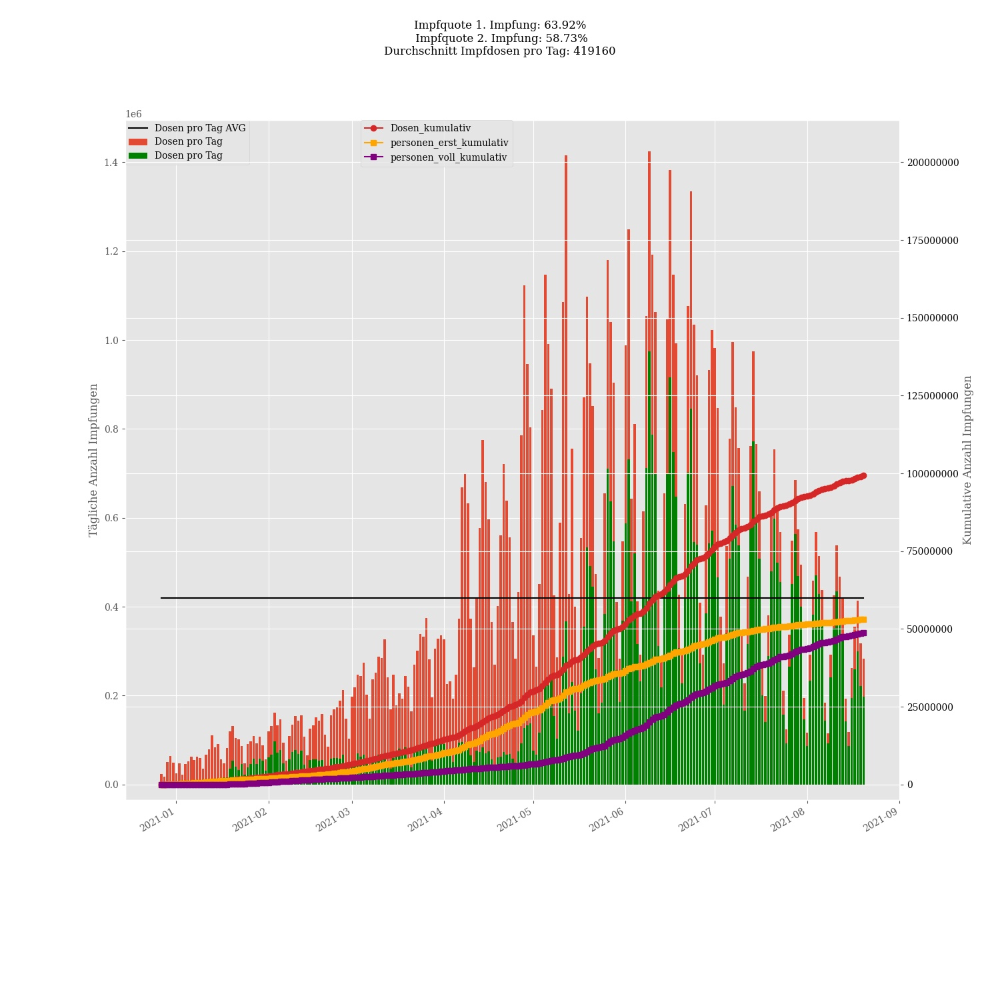

# Corona vaccine Germany - Stand 2021-04-26
## Dashboard by [Simon Hamacher](https://www.shamacher.eu)
## Impfstoffe Übersicht
**Impfstoffhersteller** | **verimpfte Dosen**
-------- | :--------:
Biontech | 18830416
Moderna | 1466856
Astrazeneca | 5595278

## Quoten
**Total Verimpfte Dosen:** | |25892550&nbsp;
-------- | :--------:| :--------:
**Erst-Impfquote** | **23.87** %| **19854550** Personen
**Voll-Impfquote** | **7.26** %| **6038063** Personen
**Imfungen Durchschnitt** | |**213988.54** pro Tag 
## Bundesländer
**Bundesland** | **Prozent von gelieferten Imfdosen verimpft**
-------- | :--------:
DE-BW | 84.99 %
DE-BY | 87.58 %
DE-BE | 88.47 %
DE-BB | 84.45 %
DE-HB | 96.07 %
DE-HH | 87.48 %
DE-HE | 83.58 %
DE-MV | 89.09 %
DE-NI | 86.41 %
DE-NW | 90.77 %
DE-RP | 87.64 %
DE-SL | 79.30 %
DE-SN | 83.32 %
DE-ST | 86.31 %
DE-SH | 86.99 %
DE-TH | 88.16 %
## Graphen

### Lieferungen je Bundesland:

### Impfungen und Lieferung je Bundesland:

