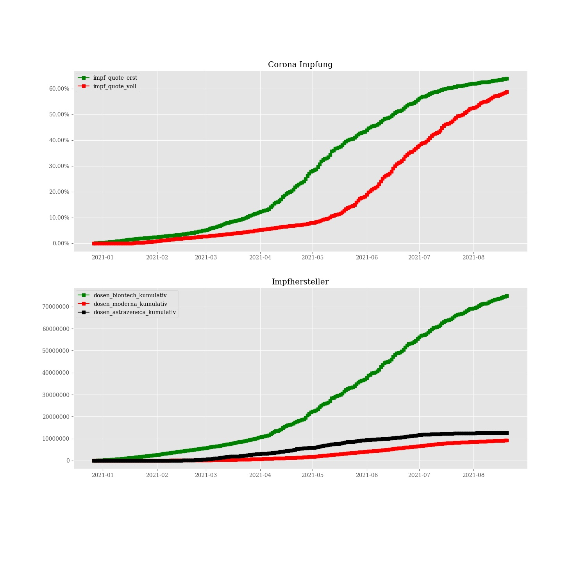

# Corona vaccine Germany - Stand 2021-08-17
## Dashboard by [Simon Hamacher](https://www.shamacher.eu)
## Impfstoffe Übersicht
**Impfstoffhersteller** | **verimpfte Dosen**
-------- | :--------:
Biontech | 73956227
Moderna | 9085183
Astrazeneca | 12595520

## Quoten
**Total Verimpfte Dosen:** | |95636930&nbsp;
-------- | :--------:| :--------:
**Erst-Impfquote** | **63.47** %| **52803002** Personen
**Voll-Impfquote** | **57.83** %| **48109314** Personen
**Imfungen Durchschnitt** | |**419977.02** pro Tag 
## Bundesländer
**Bundesland** | **Prozent von gelieferten Imfdosen verimpft**
-------- | :--------:
DE-BW | 90.87 %
DE-BY | 88.91 %
DE-BE | 87.32 %
DE-BB | 85.29 %
DE-HB | 101.69 %
DE-HH | 89.37 %
DE-HE | 86.17 %
DE-MV | 87.53 %
DE-NI | 89.05 %
DE-NW | 92.07 %
DE-RP | 95.52 %
DE-SL | 92.67 %
DE-SN | 87.91 %
DE-ST | 88.30 %
DE-SH | 95.39 %
DE-TH | 86.97 %
## Graphen

### Lieferungen je Bundesland:

### Impfungen und Lieferung je Bundesland:

