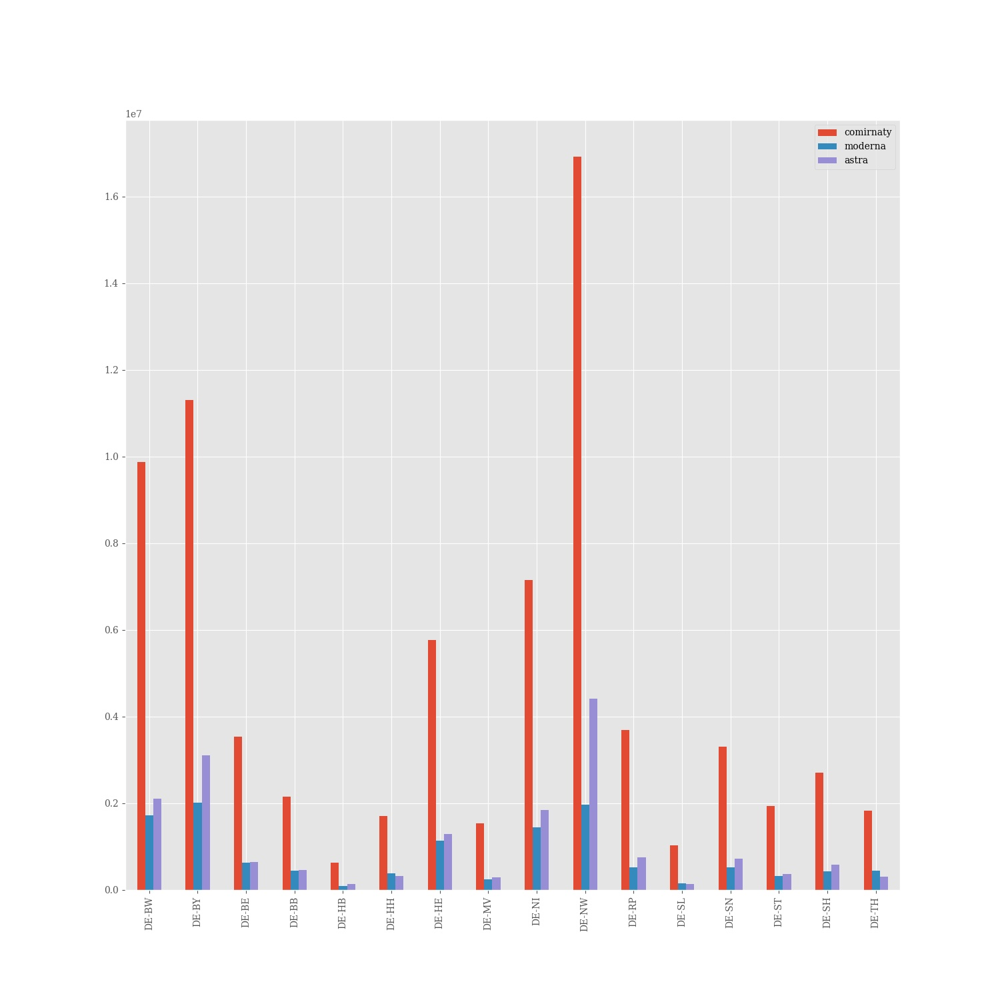

# Corona vaccine Germany - Stand 2021-06-15
## Dashboard by [Simon Hamacher](https://www.shamacher.eu)
## Impfstoffe Übersicht
**Impfstoffhersteller** | **verimpfte Dosen**
-------- | :--------:
Biontech | 45630778
Moderna | 5102438
Astrazeneca | 10121350

## Quoten
**Total Verimpfte Dosen:** | |60854566&nbsp;
-------- | :--------:| :--------:
**Erst-Impfquote** | **48.93** %| **40707016** Personen
**Voll-Impfquote** | **27.61** %| **22967526** Personen
**Imfungen Durchschnitt** | |**364120.20** pro Tag 
## Bundesländer
**Bundesland** | **Prozent von gelieferten Imfdosen verimpft**
-------- | :--------:
DE-BW | 95.12 %
DE-BY | 90.84 %
DE-BE | 91.65 %
DE-BB | 92.75 %
DE-HB | 103.28 %
DE-HH | 90.69 %
DE-HE | 92.90 %
DE-MV | 93.28 %
DE-NI | 93.82 %
DE-NW | 96.32 %
DE-RP | 94.75 %
DE-SL | 94.24 %
DE-SN | 88.67 %
DE-ST | 92.11 %
DE-SH | 95.89 %
DE-TH | 93.30 %
## Graphen

### Lieferungen je Bundesland:

### Impfungen und Lieferung je Bundesland:

