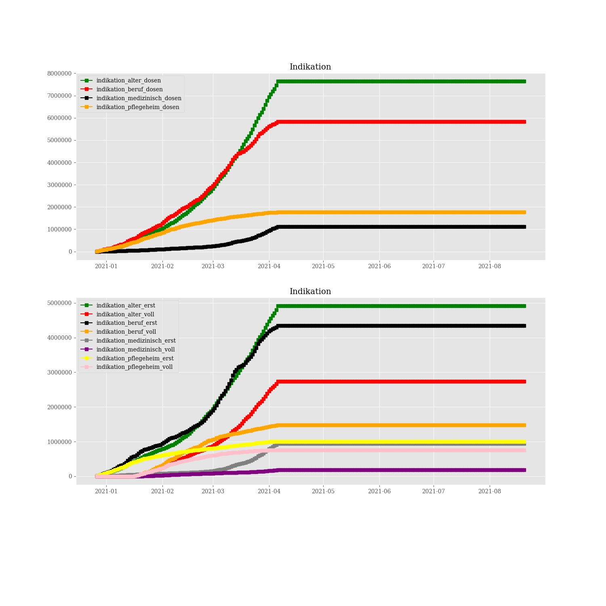

# Corona vaccine Germany - Stand 2021-03-12
## Dashboard by [Simon Hamacher](https://www.shamacher.eu)
## Impfstoffe Übersicht
**Impfstoffhersteller** | **verimpfte Dosen**
-------- | :--------:
Biontech | 7093082
Moderna | 298788
Astrazeneca | 1471400

## Quoten
**Total Verimpfte Dosen:** | 8863270
-------- | :--------:
**Erst-Impfquote** | 7.35 %
**Voll-Impfquote** | 3.31 %
**Imfungen Durchschnitt** | 116621.97 pro Tag
## Graphen

