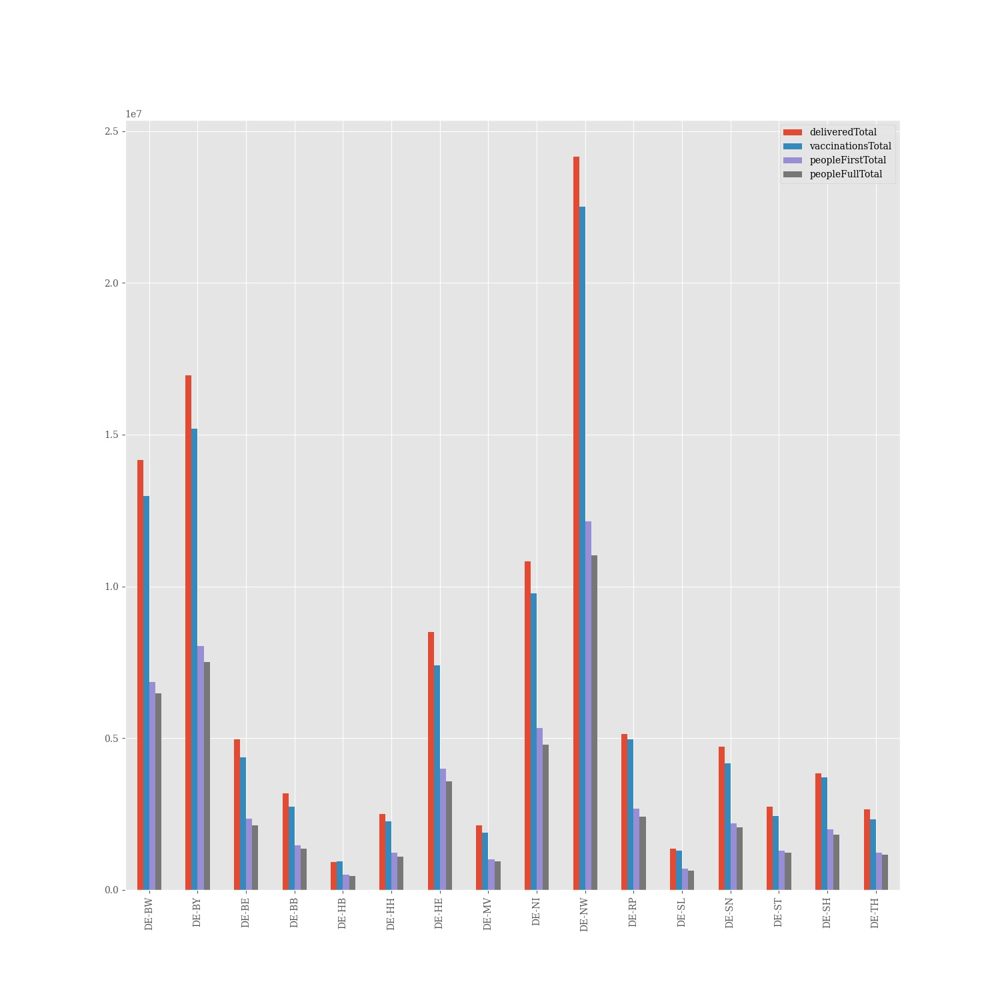

# Corona vaccine Germany - Stand 2021-06-13
## Dashboard by [Simon Hamacher](https://www.shamacher.eu)
## Impfstoffe Übersicht
**Impfstoffhersteller** | **verimpfte Dosen**
-------- | :--------:
Biontech | 44566039
Moderna | 4893759
Astrazeneca | 9985418

## Quoten
**Total Verimpfte Dosen:** | |59445216&nbsp;
-------- | :--------:| :--------:
**Erst-Impfquote** | **48.34** %| **40213007** Personen
**Voll-Impfquote** | **26.22** %| **21812429** Personen
**Imfungen Durchschnitt** | |**359380.63** pro Tag 
## Bundesländer
**Bundesland** | **Prozent von gelieferten Imfdosen verimpft**
-------- | :--------:
DE-BW | 92.71 %
DE-BY | 89.76 %
DE-BE | 89.21 %
DE-BB | 90.25 %
DE-HB | 100.52 %
DE-HH | 88.24 %
DE-HE | 90.36 %
DE-MV | 90.53 %
DE-NI | 91.05 %
DE-NW | 93.70 %
DE-RP | 92.33 %
DE-SL | 91.44 %
DE-SN | 86.69 %
DE-ST | 89.16 %
DE-SH | 93.56 %
DE-TH | 91.12 %
## Graphen

### Lieferungen je Bundesland:

### Impfungen und Lieferung je Bundesland:

